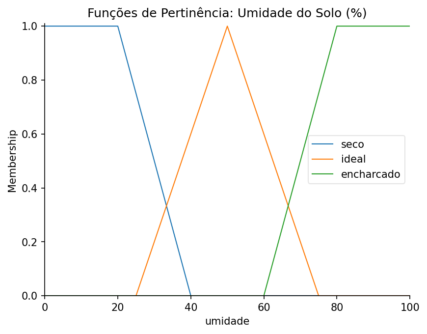
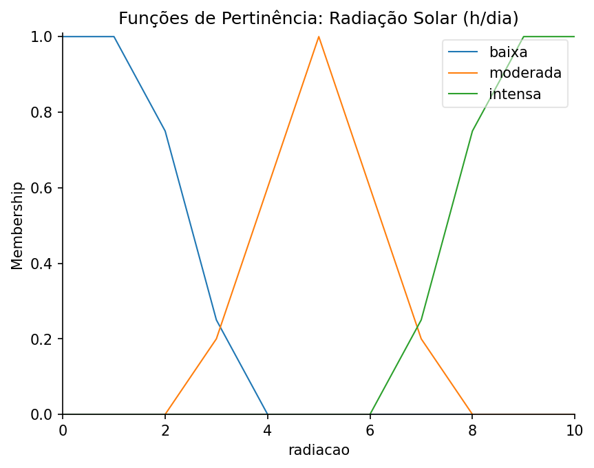
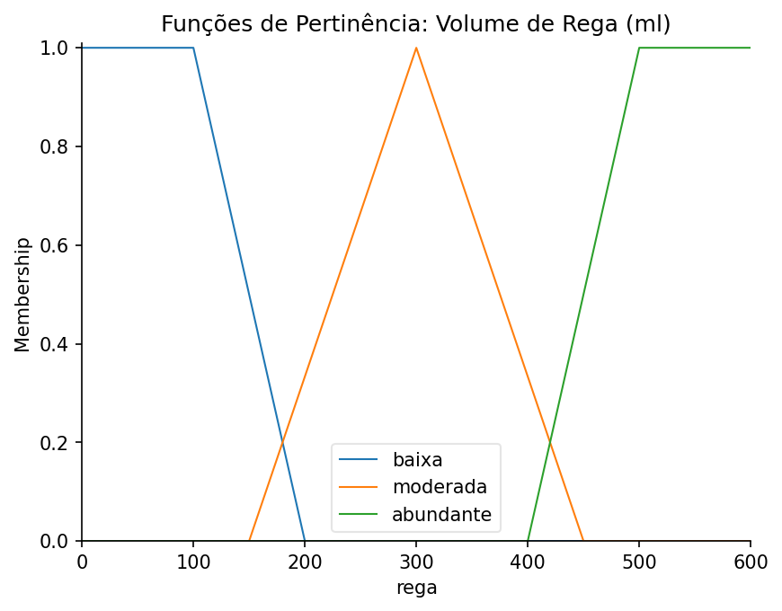
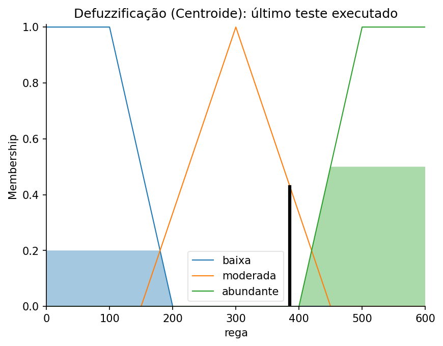

# 🌱 O Oráculo da Varanda — Controle Fuzzy de Irrigação

**Mini-Projeto 2 (MP2) — Sistemas Baseados em Conhecimento (SBC 2026.2)**
Autor: José Artur Soares Afreu

[](https://colab.research.google.com/drive/1BESP5oRvEhL_NjkkwsTFVjiw81xBhGgU?usp=sharing)

Controlador **fuzzy (Mamdani)** em Python com `scikit-fuzzy` que decide **quantos mililitros de água** dar a um vaso, a partir da **umidade do solo** e da **radiação solar** que o vaso recebe. É a evolução do [Mini-Projeto 1](../mini_projeto_1/) (regras crisp com Experta): o domínio é o mesmo, o cultivo residencial em vasos, mas a decisão de rega deixa de ser um rótulo e passa a ser uma dosagem contínua.

## Índice

1. [Descrição do domínio](#1-descrição-do-domínio)
2. [Como o sistema decide](#2-como-o-sistema-decide)
3. [Variáveis linguísticas e funções de pertinência](#3-variáveis-linguísticas-e-funções-de-pertinência)
4. [Base de regras](#4-base-de-regras)
5. [Casos de teste e resultados](#5-casos-de-teste-e-resultados)
6. [MP1 × MP2: regras crisp vs. fuzzy](#6-mp1--mp2-regras-crisp-vs-fuzzy)
7. [Limitações](#7-limitações)
8. [Como executar](#8-como-executar)
9. [Estrutura do repositório](#9-estrutura-do-repositório)
10. [Referências](#10-referências)

---

## 1. Descrição do domínio

O sistema atua em **varandas residenciais**, onde o microclima varia muito de um ponto para outro (janela com película fumê, piso em meia-sombra, canto de sol pleno com abertura Norte). Ele calcula o volume de água de uma rega a partir de duas leituras que não têm fronteira nítida:

- **Umidade do solo (%):** controla o risco entre o *estresse hídrico* (solo seco demais) e o *apodrecimento radicular* (solo encharcado).
- **Radiação solar (horas de sol direto por dia):** representa o microclima do vaso. Quanto mais sol, mais rápido o solo perde água por evaporação.

Conceitos como "solo seco" ou "sol forte" são **imprecisão linguística**: não existe um valor exato em que o solo deixa de ser "seco" e passa a ser "ideal". É esse tipo de incerteza que a lógica fuzzy trata, e é por isso que ela substitui as regras com limiares exatos do MP1.

## 2. Como o sistema decide

O controlador segue o método de **Mamdani**, em cinco passos:

```text
 Entradas (sensores)          umidade = 30 %     radiação = 5 h
        │
        ▼
 1. Fuzzificação              seco 0,5 · ideal 0,2   |   moderada 1,0
        │
        ▼
 2. Avaliação das regras      cada regra calcula seu grau de ativação α
        │                     (o "E" é o mínimo dos graus)
        ▼
 3. Implicação                o conjunto de saída de cada regra é cortado em α
        │
        ▼
 4. Agregação                 os conjuntos cortados são unidos pelo máximo
        │
        ▼
 5. Defuzzificação            centroide da área agregada  →  385,70 ml
```

Na implementação com `scikit-fuzzy`:

| Conceito de SBC | No código |
|---|---|
| Base de conhecimento | variáveis (`Antecedent`/`Consequent`), funções de pertinência e regras (`Rule`), reunidas em `ControlSystem` |
| Motor de inferência | `ControlSystemSimulation` |
| Fuzzificação | `sim.input['umidade'] = ...` |
| Inferência e defuzzificação | `sim.compute()` (centroide, o método padrão da biblioteca) |
| Saída | `sim.output['rega']` |

## 3. Variáveis linguísticas e funções de pertinência

| Tipo | Variável | Universo | Termos |
|---|---|---|---|
| Entrada | `umidade` (solo) | 0 a 100 % | `seco`, `ideal`, `encharcado` |
| Entrada | `radiacao` (sol direto) | 0 a 10 h/dia | `baixa`, `moderada`, `intensa` |
| Saída | `rega` (volume por vaso) | 0 a 600 ml | `baixa`, `moderada`, `abundante` |

| Variável | Termo | Forma | Parâmetros | Significado no domínio |
|---|---|---|---|---|
| umidade | seco | trapezoidal | [0, 0, 20, 40] | risco de estresse hídrico |
| umidade | ideal | triangular | [25, 50, 75] | faixa de equilíbrio |
| umidade | encharcado | trapezoidal | [60, 80, 100, 100] | risco de apodrecimento radicular |
| radiacao | baixa | trapezoidal | [0, 0, 1.5, 3.5] | sombra (janela fumê) |
| radiacao | moderada | triangular | [2.5, 5.0, 7.5] | meia-sombra |
| radiacao | intensa | trapezoidal | [6.5, 8.5, 10, 10] | sol pleno |
| rega | baixa | trapezoidal | [0, 0, 100, 200] | rega de manutenção |
| rega | moderada | triangular | [150, 300, 450] | rega intermediária |
| rega | abundante | trapezoidal | [400, 500, 600, 600] | reposição alta |

**Por que três termos por variável?** Cada variável precisa distinguir os dois extremos que exigem ação oposta (falta e excesso de água, pouco e muito sol) e um estado intermediário.

**Por que trapézios nos extremos e triângulos no meio?** Os trapézios criam um **platô de pertinência máxima** nas condições de perigo, em que a resposta do sistema precisa ser firme (solo muito seco, solo encharcado, sol pleno). O estado intermediário é um ponto de equilíbrio, representado por um triângulo com um único pico.

**Sobreposição proposital:** os termos de uma mesma variável se cruzam. Com 30 % de umidade, o solo é "seco" em grau 0,5 e "ideal" em grau 0,2 ao mesmo tempo. Não há um ponto em que a resposta "vira a chave".

### Gráficos das funções de pertinência







## 4. Base de regras

Com 2 variáveis e 3 termos cada, a grade completa tem 3² = **9 regras**. Todas as combinações do espaço de entradas estão cobertas, sem lacunas.

| Umidade \ Radiação | Baixa | Moderada | Intensa |
|---|---|---|---|
| **Seco** | moderada (R3) | abundante (R2) | abundante (R1) |
| **Ideal** | baixa (R6) | baixa (R5) | moderada (R4) |
| **Encharcado** | baixa (R9) | baixa (R8) | baixa (R7) |

| R | Umidade | Radiação | Rega | Justificativa agronômica |
|:-:|:-:|:-:|:-:|:--|
| 1 | seco | intensa | abundante | Solo ressecado e calor intenso exigem hidratação emergencial. |
| 2 | seco | moderada | abundante | Solo crítico precisa de alta reposição mesmo fora do sol pleno. |
| 3 | seco | baixa | moderada | Evaporação lenta; irrigação abundante causaria acúmulo de água no fundo. |
| 4 | ideal | intensa | moderada | Sol forte consome as reservas rápido; exige manutenção protetiva. |
| 5 | ideal | moderada | baixa | Condição de equilíbrio; apenas manutenção leve. |
| 6 | ideal | baixa | baixa | A sombra mantém o solo fresco; intervenção mínima. |
| 7 | encharcado | intensa | baixa | Excesso de água; conta-se com o sol para secar naturalmente. |
| 8 | encharcado | moderada | baixa | Risco alto de asfixia das raízes; reduzir ao mínimo o fluxo. |
| 9 | encharcado | baixa | baixa | Cenário crítico para mofo; aplicar o mínimo que o modelo recomenda. |

## 5. Casos de teste e resultados

A função `testar_oraculo_fuzzy(nome_teste, umi_val, rad_val)` executa uma inferência completa e imprime a saída defuzzificada. O parâmetro `nome_teste` é apenas um rótulo para a impressão.

| Teste | Entradas | Regras que disparam | Saída |
|---|---|---|---|
| 1. Seca severa + sol intenso | umidade 10 %, radiação 9 h | R1 (α = 1) → abundante | **522,22 ml** |
| 2. Condições ideais | umidade 50 %, radiação 5 h | R5 (α = 1) → baixa | **77,78 ml** |
| 3. Transição | umidade 30 %, radiação 5 h | R2 (α = 0,5) → abundante; R5 (α = 0,2) → baixa | **385,70 ml** |

**Interpretação:**

- **Teste 1:** o solo é totalmente "seco" e o sol totalmente "intenso", então só a R1 dispara, com força máxima. A saída é o centro de massa do conjunto "abundante" inteiro: cerca de meio litro por vaso.
- **Teste 2:** o solo está no pico de "ideal" e o sol no pico de "moderada". Só a R5 dispara, e a saída é o centro de massa de "baixa" inteiro: rega de manutenção.
- **Teste 3:** o solo é parcialmente seco (0,5) e parcialmente ideal (0,2), então **duas regras que discordam disparam juntas**. A R2 pede rega abundante com força 0,5 e a R5 pede rega baixa com força 0,2. O sistema as combina e devolve um valor intermediário, mais próximo de "abundante" porque essa regra tem mais força. O resultado cai na região de "moderada", embora nenhuma regra peça "moderada".

### Defuzzificação do teste 3

A área colorida é a agregação dos conjuntos de saída cortados em α ("abundante" em 0,5 e "baixa" em 0,2). A linha vertical preta marca o centroide, o volume de rega recomendado.



### Teste personalizado

O notebook tem uma célula em que você escolhe os valores. Com os padrões (umidade 65 %, radiação 7 h), quatro regras disparam ao mesmo tempo (R4, R5, R7 e R8) e a saída é **215,86 ml**.

## 6. MP1 × MP2: regras crisp vs. fuzzy

O [MP1](../mini_projeto_1/) era um SBC em Experta, com encadeamento progressivo, que recebia características da planta e devolvia uma decisão consolidada (local, substrato, rega, vaso e adubação). O MP2 retoma o domínio e refaz, com lógica fuzzy, a parte em que as regras crisp mais perdem: a **dosagem de água**.

| Aspecto | MP1 (Experta, crisp) | MP2 (fuzzy Mamdani) |
|---|---|---|
| Decisões | cinco: local, substrato, rega, vaso e NPK | uma: volume de rega |
| Entradas | categorias prontas (luz, umidade, drenagem, tamanho, produção...) | dois valores numéricos de sensor |
| Saída da rega | três rótulos (frequente, moderada, espaçada: R7 a R9) | contínua, de 0 a 600 ml |
| Regras | 22, em 3 níveis de encadeamento | 9, grade 3×3 completa |
| Fronteiras | salto entre categorias (drenagem média gera uma receita, alta gera outra) | transição gradual por graus de pertinência |
| Conflito entre regras | `salience` (500, 320, 315, 300) e `NOT` (R10 a R12, R18, R21 e R22) | nenhum: o disparo de várias regras ao mesmo tempo é o funcionamento normal |
| Explicabilidade | rastro (*trace*) das regras disparadas | regras, graus de ativação (α) e gráfico da agregação |

**Expressividade.** No MP1 a tradução do mundo para categorias era feita pelo usuário, e cruzar a fronteira entre duas categorias mudava a resposta de uma vez. No MP2 a entrada são números de sensor e a tradução para "seco", "ideal" ou "encharcado" acontece dentro do sistema, em graus. A saída deixa de ser um rótulo e passa a ser qualquer valor entre 0 e 600 ml. E, no teste 3, duas regras discordantes resultam em uma dose intermediária, sem precisar de prioridades.

**Complexidade.** Comparar 22 regras com 9 engana: o MP1 decide cinco coisas e o MP2 decide uma. Olhando só a rega, eram 3 regras no MP1 e são 9 no MP2, porque entrou uma segunda variável. O que muda é o que as regras entregam. Em versão crisp, as mesmas 9 regras produziriam só três níveis de saída; aproximar a suavidade do fuzzy com regras crisp exigiria dividir cada variável em muitas faixas (com dez faixas em cada, por exemplo, seriam 100 regras). O fuzzy cobra o seu preço em outro lugar: a **calibração das funções de pertinência**, e o número de regras cresce como kⁿ (k termos, n variáveis) quando entram novas entradas.

**Quando cada um serve.** Para decisões discretas ("janela fumê ou piso da varanda", "qual vaso"), regras crisp são o caminho natural: não existe 40 % de janela fumê. As exceções com limite bem definido, como o cultivo em água do MP1, funcionam como *guardrails* que precisam disparar sempre. O fuzzy se destaca em grandezas contínuas, como o volume de água. Em um sistema completo, as duas abordagens se complementam.

## 7. Limitações

- **Piso de ≈ 77,78 ml.** Esse é o centroide do conjunto "baixa" inteiro e, portanto, o menor volume que o sistema consegue recomendar. Qualquer cenário em que só "baixa" dispara com força máxima, como solo encharcado (umidade 85 %, radiação 1 h), devolve exatamente o mesmo valor do teste 2. O modelo distingue *regar muito* de *regar pouco*, mas não distingue *manutenção* de *suspender a rega*. Uma melhoria seria criar um termo de saída "nula" para o solo encharcado.
- **Parâmetros definidos por conhecimento de domínio.** As curvas e as regras foram modeladas pelo autor e não foram calibradas com dados reais de sensores. Técnicas como o ANFIS poderiam ajustá-las a partir de dados.
- **Perfil da planta fora do escopo.** O MP1 usava drenagem, porte e produção da planta. Aqui o foco é a dosagem, então espécies diferentes recebem a mesma resposta para as mesmas leituras. Também não entram temperatura nem previsão de chuva.
- **Crescimento das regras.** Com mais entradas, a base cresce como kⁿ (uma terceira variável com 3 termos levaria a 27 regras).

## 8. Como executar

O projeto é um notebook Jupyter (`mini_projeto_2.ipynb`) e depende apenas de Python e de algumas bibliotecas.

### Opção A: Google Colab (mais simples)

1. Clique no botão **Abrir no Colab** no topo deste README.
2. No menu, escolha **Ambiente de execução → Executar tudo**.

A primeira célula instala o `scikit-fuzzy` automaticamente. Não é preciso configurar mais nada.

> No Colab, a pasta `img/` gerada pelo notebook é temporária. Baixe as imagens antes de encerrar a sessão, se quiser guardá-las.

### Opção B: execução local

**Requisitos:** Python 3.9 ou superior (testado com Python 3.12) e `git`.

```bash
# 1. Clonar o repositório e entrar na pasta do projeto
git clone https://github.com/arthursoars/Projetos-de-SBC.git
cd Projetos-de-SBC/projetos/mini_projeto_2

# 2. (Recomendado) criar e ativar um ambiente virtual
python -m venv .venv
source .venv/bin/activate          # Windows: .venv\Scripts\activate

# 3. Instalar as dependências
pip install scikit-fuzzy matplotlib jupyter

# 4. Abrir o notebook
jupyter notebook mini_projeto_2.ipynb
```

Com o notebook aberto, use **Kernel → Restart & Run All**. A primeira célula de código (`!pip install scikit-fuzzy -q`) também funciona localmente e pode ser executada mesmo com a biblioteca já instalada.

### Resultado esperado

A célula de testes (seção 3) deve imprimir:

```text
--- TESTE: Seca Severa + Sol Intenso ---
Entradas: Umidade = 10%, Radiação = 9h
Saída Defuzzificada (Centroide): 522.22 ml de água

--- TESTE: Condições Ideais e Equilibradas ---
Entradas: Umidade = 50%, Radiação = 5h
Saída Defuzzificada (Centroide): 77.78 ml de água

--- TESTE: Solo Parcialmente Seco + Meia-sombra (Transição) ---
Entradas: Umidade = 30%, Radiação = 5h
Saída Defuzzificada (Centroide): 385.70 ml de água
```

A célula de gráficos (seção 4) gera os quatro gráficos e os salva em `img/` (`umidade.png`, `radiacao.png`, `rega.png` e `defuzzificacao.png`). A célula de teste personalizado (seção 5), com os valores padrão, imprime `215.86 ml`.

### Organização do notebook

| Seção | Conteúdo |
|---|---|
| Introdução e preparação | contexto, tabela de variáveis e instalação das dependências |
| 1. Modelagem do domínio | variáveis linguísticas e funções de pertinência |
| 2. Base de regras | as 9 regras, o `ControlSystem` e a simulação |
| 3. Casos de teste | a função `testar_oraculo_fuzzy` e os três testes |
| 4. Visualização gráfica | os 4 gráficos (3 de pertinência e 1 de defuzzificação) |
| 5. Testes personalizados | célula para testar valores próprios |

## 9. Estrutura do repositório

```text
mini_projeto_2/
├── README.md
├── mini_projeto_2.ipynb
└── img/
    ├── umidade.png
    ├── radiacao.png
    ├── rega.png
    └── defuzzificacao.png
```

## 10. Referências

- ZADEH, L. A. *Fuzzy Sets*. Information and Control, 8(3), 1965.
- MAMDANI, E. H.; ASSILIAN, S. *An experiment in linguistic synthesis with a fuzzy logic controller*. International Journal of Man-Machine Studies, 7(1), 1975.
- Documentação do scikit-fuzzy: <https://scikit-fuzzy.github.io/scikit-fuzzy/>
